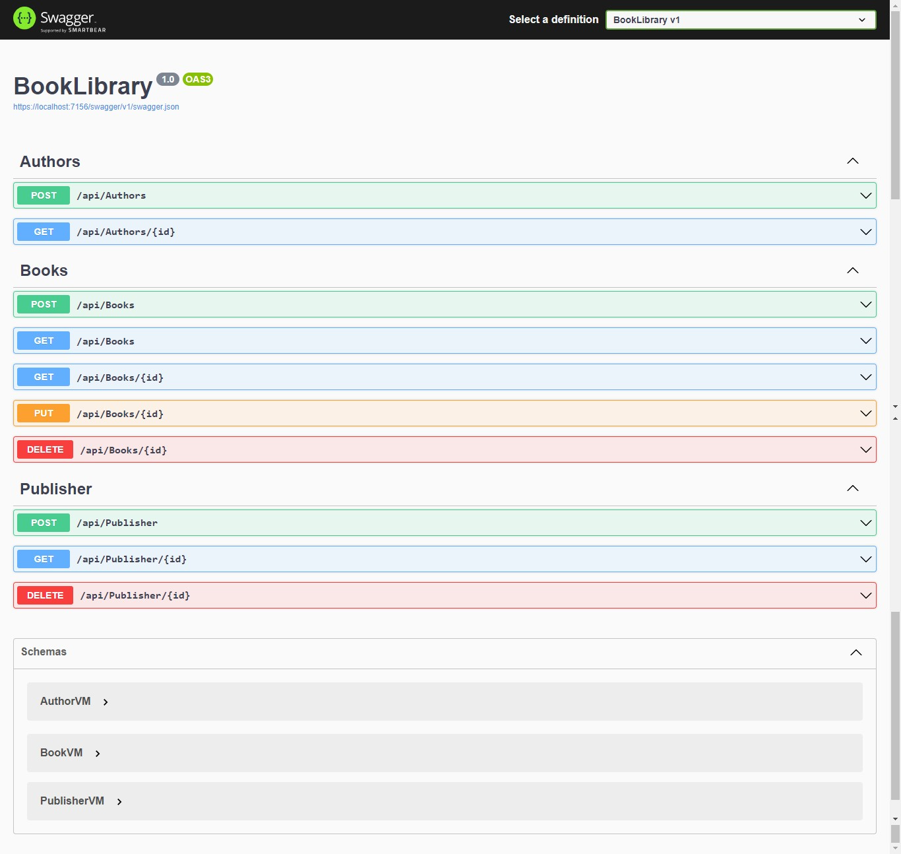

# BookLibrary

1.Backend Web API with ASP NetCore 6 with VIEW MODELS.

2.Entity Framework Core, Many2Many relationship with Fluent APIs and MySQL Databases.

## Here is a sneak preview of the app project using Swagger.
